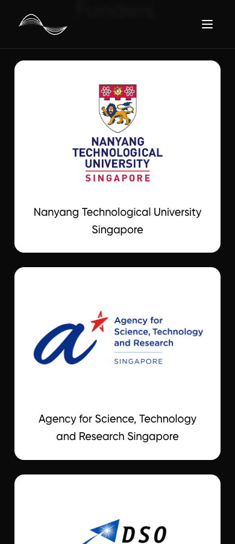
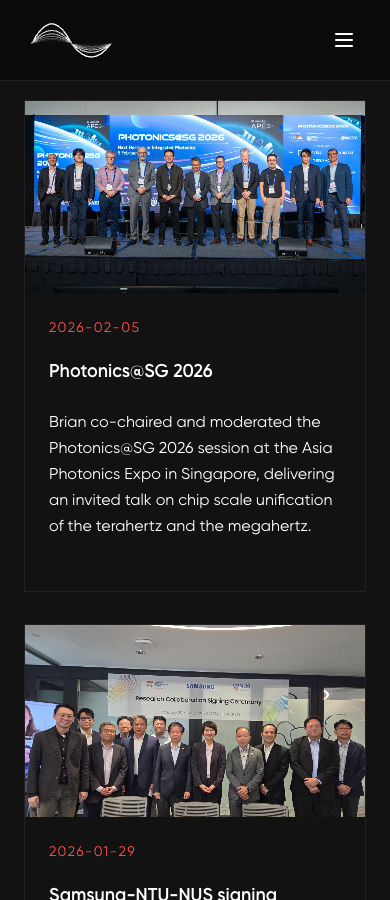
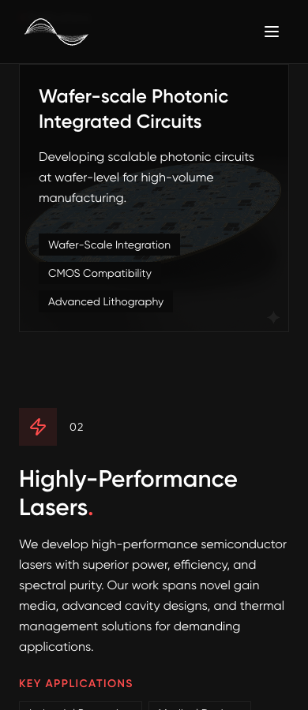

# Text readability checks

Checked on 30 September 2026.

Funder cards now include each organization's full name as text, with more space for the original logo. Body copy uses at least 16px and secondary labels at least 14px on the affected pages. Home news titles and descriptions no longer have line limits. The brighter red accent has dark text when used as a button fill; hovered primary buttons keep an opaque background.

Long words can wrap, contact fields have persistent labels, and tall content blocks reveal when they enter the viewport. The navigation logo and gaps keep their dimensions when the user enlarges text. The route links have room to scroll.

Validation:

- Eight routes passed 24 page checks at widths of 320px, 390px, and 1440px.
- The same routes passed 16 checks at 320px and 390px with the root text size doubled to 32px.
- All five funder logos and captions passed checks at 320px, 390px, 768px, and 1440px.
- Mobile menus passed 42 link checks across three sizes with normal and doubled text in portrait and landscape.
- Screenshots cover funders, full news descriptions, research cards, and the home hero.
- An independent reviewer checked the hero button's hover contrast and enlarged text in the landscape menu.
- The production build passed. Full lint matches the prior baseline: three errors and nine warnings.

Routes: Home, About, Team, Research, Publications, News, Contact, and the news photo viewer. The checks found no clipped or invisible text, horizontal overflow, text below 14px, or contrast failures against solid backgrounds. Logo checks confirmed image loads, original proportions, and full captions.

The automated contrast probe covers text and ancestor backgrounds. Image backgrounds and hover states received separate visual checks. Browser checks used Chromium emulation. No physical-device Safari test.

